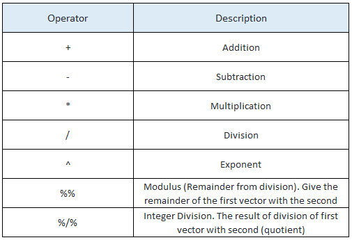

# Introduction to Programming *Languages*

Computer programming languages are, literally, languages. 
It is not a metaphor to call them languages.
In Google, a language is defined as "the method of human communication, either spoken or written, consisting of the use of words in a structured and conventional way."
A computer programming language is a written method of communication to communicate instructions to a computer. 
Like other languages, programming languages have parts of speech, syntax and punctuation. 


## Nouns

The nouns of programming languages are the variables or objects that take on particular values in memory. 
Variables are stored in various *types* or *classes*. 
Data types are often numeric, such as integers or real numbers. 
Depending on the particular language, these types are sometimes called "float" or "long" or "double", depending on the degree of precision, as in the number of decimal places or significant digits.  
There are also data types for holding non-numeric data, such as letters of the alphabet, in variables called *strings* or *character* vectors. 


Examples of *classes* of data in ```R``` are as follows: 


A variable can have a single element (i.e. atomic) or be a vector or array of values. 
Typically, vectors and arrays comprise elements of the same data type. 
For statistical programming, languages such as ```R``` and ```Python``` also allow for the collection of data into data frames, in which each column can be of a separate data type. 


In the languages we will use, values are represented in binary digits, or "bits".
The storage of a 32-bit real number is as follows:


For each individual variable or element of an array of data, the values are actually stored in a sequence of, for example, 32 adjacent locations in memory. 

Characters are stored similarly, with, for example, 8 bits to generate the decimal numbers 0 to 127, which correspond to the characters in the following ASCII table:


These numbers 0-127 are represented in memory by an 8-bit binary sequence. 
In binary, numbers are represented as the sum of (either 1 or 0 times) 2 raised to the exponent in the positions 0-7. 
For example, the binary representation of the decimal number 65, 
corresponding to the ASCII character "A" is ```1000001```.
The binary number representing "a" is different: ```1100001```, which is 97 in decimal. 
Note that eight bits can generate numbers from 0-255, 
which forms a larger character set, such as UTF-8, which contains all the ASCII characters plus another 128. 


The interpreter or compiler for a particular language will translate variables into these binary formats for the C.P.U. to execute commands.

We have many objects to work with. 
Now, what can we do with them?


## Verbs

The action words of programming are sorted into several categories. 


### Operators 

There are several kinds of operators that each perform a different function. 


### Assignment operator

Before we can perform any operations, a variable has to be initialized with an assignment operator. 
An assignment operator assigns a value to a variable with a particular name. 
This name is a variable's *address*. 
It corresponds to a location in memory in which the (binary) data are stored.


In ```R```, the assignment operator is ```<-```

```R
x <- 7
first_name <- "Linus"
```

In ```Python```, the assignment operator is ```=```

```python
y = 5
last_name = "Torvalds"
```

When reading the assignments aloud, you would say "y is assigned 5" 
or "y is set equal to 5" but not "y equals 5"
because that would be confusing the assignment with one of the relational operators discussed next. 


### Relational operators

These operators are used to determine whether conditions hold.
They output what are called *binary*, *logical*, or *Boolean*, variables.
They are commonly used for flow control, such as for ```if``` statements, discussed below.
The precise syntax differs by programing language but the most common are shown in the following table.


### Logical Operators

The logical variables from two relational operators can be combined into another logical variable using logical operators. 
In ```R```, there are the following possibilities, illustrated by Venn diagrams with the sets in which the logical variable ```x``` and ```y``` are ```TRUE```.


The ampersand "&" represnts *and*, while the vertical bar, or pipe, "|" represents *or*.
In ```python```, the words ```and``` and ```or``` can also be used, with the word ```not``` taking the place of the negation operator ```!```.
For example, let ```x <- a >= 7``` and ```y <- a <= 20``` for some variable ```a```.
The condition ```x & y``` returns ```TRUE``` when ```a``` is between 7 and 20. 


### Arithmetic operators

These are the operators that are most familiar to you. 
These operators work much like they do with pencil and paper, following the order of operations. 

In ```R``` these operators are used



In ```python``` these are the equivalent operators


These operators can be combined with brackets for calculations performed following the usual order of operations in arithmetic. 
Although useful on their own, these operators are often combined to perform a specific calculation within a function. 


### Functions

A function is an object that returns another object or performs some procedure using inputs called *arguments*. 
In languages like ```R``` and ```python```, there are many funtions available that are either built in to the language or available on code repositories worldwide. 
Many common mathematical calculations are implemented, such as ```max()``` to calculate the maximum, ```min()``` to calculate the minimum, and ```mean()``` to calculate the mean, or the average, of a series of values. 


To become more productive with these languages, you will often need to program 
your own functions. 
Some examples of the syntax in ```R``` are as follows

```R
add_numbers <- function(num_1, num_2) {
    sum <- num_1 + num_2
    return(sum)
}

greeting <- function(name) {
    print(sprintf("Hello, %s!", name))
}


addnumbers(num_1 = 2, num_2 = 4)
[1] 6

gretting(name = "Linus")
[1] "Hello, Linus!"

```

In ```Python``` the syntax is different but the idea is the same. 

```python
def add_numbers(num_1, num_2):
    sum = num_1 + num_2
    return sum

def greeting(name):
    print(sprintf("Hello, %s!", name))


addnumbers(num_1 = 2, num_2 = 4)
> 6

gretting(name = "Linus")
> "Hello, Linus!"

```
Building your own functions is a large part of programming. 
We will study this in greater detail throughout this course. 


### Methods

In a programming paradigm called object-oriented programming, 
there is a special kind of function designed to work with a particular data type called an object. 
Some built-in methods work with one of the above data types, such as strings or characters. 
An object can also be a mix of several data types. 
Typically, an object is designed with a particular application in mind. 

In Python, here are many methods designed for type string, for example:

```python
my_string = "ThIs_Is_A_sTrInG"
print(my_string.lower())
> "this_is_a_string"
print(my_string.upper())
> "THIS_IS_A_STRING"
```


## Conjunctions, Prepositions and Adverbs 

With so many operators and functions available, you can perform many kinds of calculations. 
The programs you write will be more interesting and useful when you specify when or how many times a calculation is to be performed. 

### Conditional Logic

Conditional logic is what permits the great flexibility of programming languages for designing algorithms. 
It detrmines under what conditions an operation is to be performed. 
The basic conditional statement is the ```if``` statement.

#### ```if``` statements

The ```if``` statement is used to execute the commands in a block of code only if
certain conditions hold. 
As shown in this flow chart, the program will skip that block of code and continue below
when the condition is not satisfied. 


In ```R``` the syntax for an ```if``` statement is

```R
if (condition) {
    # Execute statements when condition is TRUE.
    # ...
}

# Continue with remaining statements in any case.
```


A simple example is:

```R
if (time == "8:00" & day != "Sunday") {
    print("Wake up!")
}
```


#### ```if```...```else``` statements

Sometimes it is necessary to execute one command if a contition is ```TRUE```
and execute other commands when the condition is ```FALSE``` 
but avoid executing these other commands if the condition is ```TRUE``


In the flow chart above, the program executes the first block of code then skips the second block when ```condition == TRUE```.
When ```condition``` is ```FALSE```, the interpreter skips the first block of code and runs only the second. 

```R
if (condition) {
    # Execute statements when condition is TRUE.
    # ...
} else {
    # Execute statements when condition is FALSE.
}
```

Consider this example:

```R
if (weather == "rainy") {
    print("Bring an unbrella.")
} else {
    print("Leave your umbrella at home.")
}
```

For more complicated situations, you can also chain a series of nested ```if``` statements. 

```R
if (weather == "rainy") {
    print("Bring an unbrella.")
} else if (weather == "sunny") {
    print("Bring a hat.")
} else {
    print("Bring both, just in case.")
}
```
Furthermore, each code block can contain other ```if``` statements or *loops*.


### Repetition

Repetition is used to perform a fixed sequence of operations a number of times by iterating over a block of code. 
There are two main kinds of repetion that differ in the way the user specifies the sequence and number of executions.

#### ```for``` loops

For loops are useful when you have to repeat a calculation for a 
predetermined number of inputs. 
These calculation follow this flow chart:


After an *iteration* is performed, the interpreter automatically *increments* the *iterator* 
to the next value to repeat the calculation, until all iterations are performed.  
The syntax is:

```R
for (object in list_of_iterators) {
    # Execute statements for each object in the list of iterators.
    # ...
}
```

The prototypical example of a for loop follows a sequence of numbers.

```R
for (i in 1:10) {
    print(i^2)
}
```

Alternatively, a ```for``` loop can be used on a *list* or *vector* of objects.

```R
for (day_prefix in c("Mon", Tues", "Wednes", "Thurs", "Fri") {
    print(sprintf("%sday", day_prefix))
}
```

By the way, the ```%s``` is called an *escape sequence* which exits the string to insert the string argument stored in ```day_prefix```.


#### ```while``` loops

A ```while``` loop is used for repeated calculations 
when the conditions for the calculation are not known in advance.
For example, these are useful when you don't know in advance
how many times the calculation must be performed beacuse the condition
depends on the previous steps. 
Alternatively, your calaculation might be continued until some level of *tolerance* is achieved. 

A ```while``` loop has the following flow chart:


The commands follow a sequence of commands like this:

```R

while (condition) {
    # Execute statements when condition is TRUE.
    # ...
    # condition may change during an iteration.
    # ...
    # At end of block, evaluate condition and determine whether
    # to execute the code block again. 
}
```

As an example, you can count the number of times that you can divide a number by two
before it is smaller than one percent.

```R
num <- 3
step <- 0
while (num > 0.01) {
    step <- step + 1
    num <- num/2
}

```

Warning: It is possible that the ```while``` loop continues forever, 
unless the programmer (You!) have made sure that the exit condition is well-defined. 


