# GitHub Quick Reference

This is a short list of the ```git``` commands used in your daily routines. 
Bookmark this page until you know your way around GitHub. 

The most common commands are summarized in this table:

| Command                           |  Action                                      |
| --------------------------------- |  ------------------------------------------- |
| ```git clone <url to the repo>``` |  Clone a repo to your laptop                 |
| ```git pull origin master```      |  Pull content from a repo to your laptop     |
| ```git add .```                   |  Add changes to staging area to commit       |
| ```git commit -m "message"```     |  Commit changes as a group to push online    |
| ```git push origin master```      |  Push content to a repo from your laptop     |
| ```git status```                  |  Check status of changes on your laptop      |


Eventually, you will get to the point that your use of GitHub is uneventful and the commands work as they should. 
In the off chance that something does go wrong, troubleshooting tips are outlined in what follows. 
You can always refer back to this guide to get back on track. 


# GitHub Troubleshooting Guide


## Guide to ```git``` command ```clone```: the first time

To start work on a project stored in an online repository, use ```git clone```:

```
git clone <url to your repo>
```
in your terminal window (GitBash). 
Make sure you do this in a separate folder that is not contained in a repository. 
It will make a local copy at your machine in the working directory. 


### When this works

This should work almost all of the time, once you get it working once. 
If you have GitBash and ```git``` installed and access to the internet, it should work fine. 

You need to be logged in to GitHub or have previously entered your login credentials. 
If not, you will typically be promted for GitHub login credentials through a pop-up window or at the command line in your terminal. 

### When this fails

It fails when you do not enter the url for a valid repository for which you have access. 
make sure that you copy the url from the GitHub home page for the target repo. 

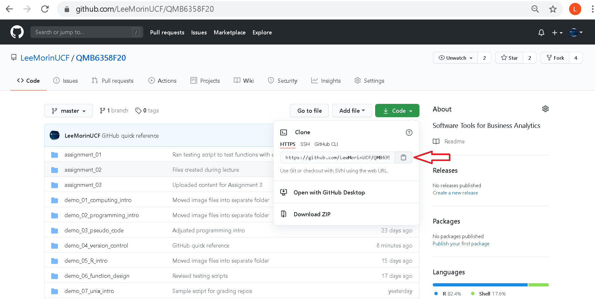

In this case, the url should match the url in the address bar, with extension ```.git```.

```
git clone https://github.com/LeeMorinUCF/QMB6358F20.git
```


### How to fix it

Make sure the repo is spelled correctly and that you have ```git``` and GitHub installed. 
Be careful not to miss part of the url if typing or copyng it manually.


## Guide to ```git``` command ```status```: to see what you have done

The ```git status``` command gives you a status report of the current changes to the files in your local repository (on your laptop). 


### When this works

If you have not made any changes you should get a message like the following: 

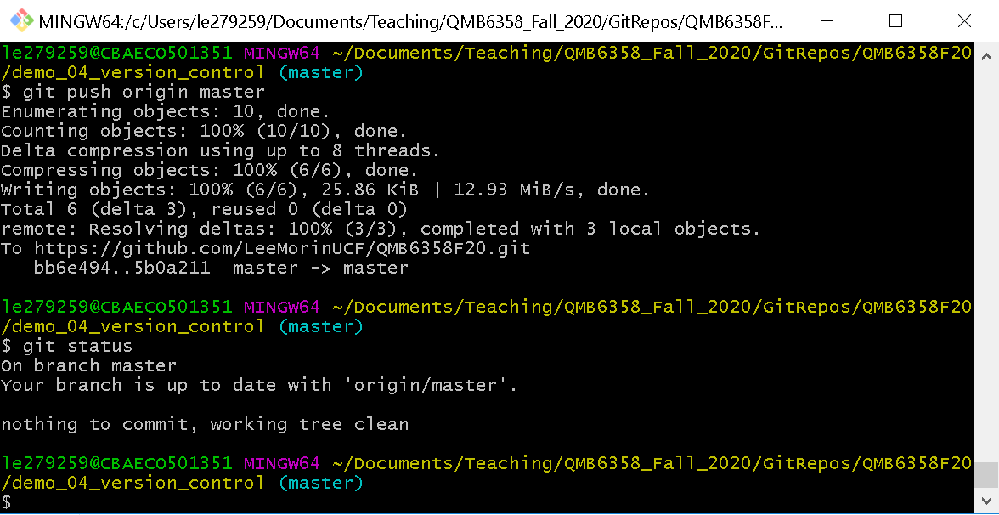


If you have made some changes, they should appear in red or green, depending on their status. 
If they have been ```add```ed to the staging area to commit, they will be displayed in green. 
Otherwise, new changes not yet ```add```ed will be displayed in red. 
The following is an example: 


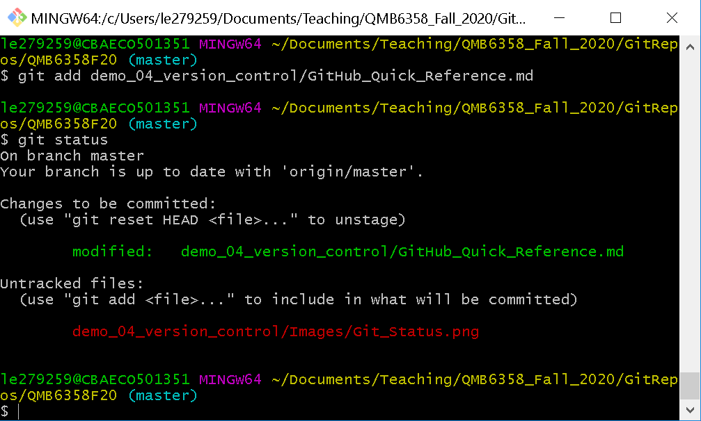


### When this fails

This command only works inside a repository.
If there is an excessively long printout of red text, verify that your present working directory is contained within a GitHub repository on your local machine (your laptop), such as your assignment folder or your copy of the class repository. 

For example, if your working directory is one step outside the repository, you would see something like this:

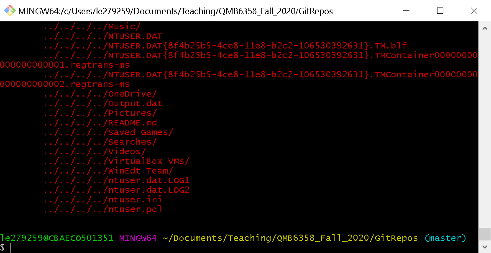

Note that the command prompt is outside of the folder containing the repo ```QMB6358F20```. This is not a repository, so ```git``` is confused about the status and includes many files. 
It appears as though all files in that folder are candidates for a repository. 


It could also happen that ```git``` does not recognize changes that you have made. 
It will only recognize changes that occur within the current folder in the repository. 
This happened to some of us in class during Module 3.
We made changes to files in the folder ```assignment_02``` and other files in ```assignment_03```. 
When entering ```git status``` within the folder ```assignment_02```, only the changes within ```assignment_02``` were displayed. 


### How to fix it

To include all changes, navigate into the root folder of your repository. 
Use ```cd``` to change directory, with ```cd ..``` to move up one directory or ```cd QMB6358F20``` from outside to move into the repository ```QMB6358F20```. 
This will be the folder with the name of your repository, with the ```ls``` of files and folders that match the first that you see on the online copy.


## Guide to ```git``` command ```pull```: to update content from other contributors

When another user makes changes to the remote repository (online), you should ```pull``` these changes to your local repo (on your laptop). 
The default command is

```
git pull origin master
```
This uses the program ```git``` to ```pull``` the content from the online repo (the ```origin```, from which you originally ```clone```d it) and it ```pull```s the content from the ```master``` branch, which is the default. 
I discuss branches in the ```README.md``` file within this demo. 

### When this works

When this command is successful, you should see a screen like the following:


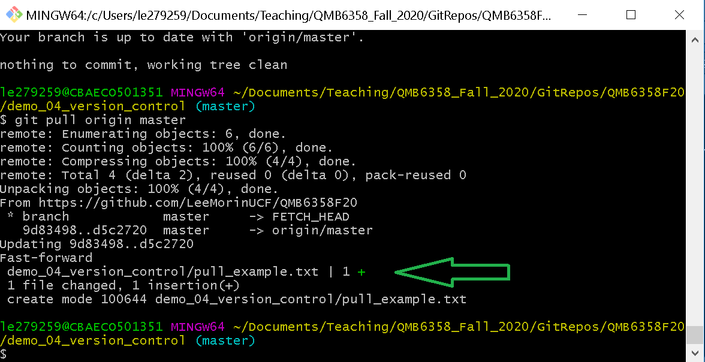

The green arrow highlights the file that was added by some user to the remote repository (online) that was pulled to the local copy (my laptop). 
The green plus sign indicates a file that was added and its path in the repository. 


### When this fails

One way that this can fail is if there is a conflict. 
That is, some files have been changed both on the online repo and in your local copy. 
This often happens when you take notes in your files or run some programs that output files, while I do the same during a lecture. 
It can also happen in the workplace if multiple people are working on the same files.
If ```git``` were to blindly pull the online copy, it would replace the files and your changes would be lost.

When this happens, you will see output like this:


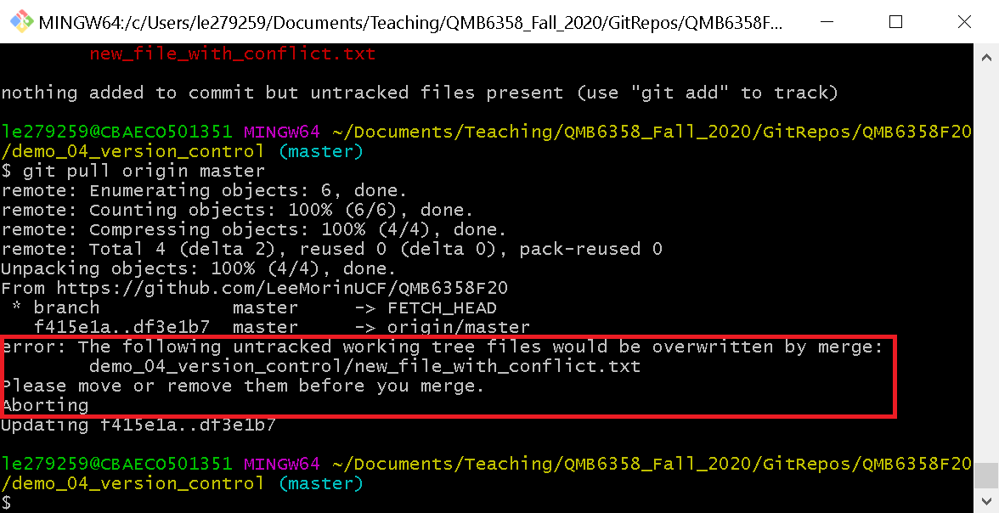


### How to fix it

An easy way to fix this is to identify the affected files in the message and change those file names to make them unique. 
If they are changes that I made on my copy, while someone else pushed changes to the same file, I usually rename it by adding my initials ```_LM``` or something like ```_v2``` for "version 2". 

Now a human (you?) can manually go through the conflicting files and decide what changes should be incorporated into the official file (if that is important).


Sometimes GitHub will be a little too proactive and decide to merge the files for you. 
If so, it will demand that you enter a message to descripe the changes. 
This will trigger an antiquated but reliable text editor called ```vim``` and I profusely apologize for you having seen this so early in your compting career. 
The solution is to give it the merge message that it wants:
1. Press ```i``` to ```INSERT``` (you should now see the message ```INSERT``` at the bottom of the screen). 
1. Move to the first empty line and type a message describing the situation, 
e.g. ```"Pulled changes from lecture and merged with my comments in class"```. 
1. To exit ```vim``` press ```<Esc>``` to exit ```INSERT``` mode, press colon ```:``` to enter commands, press ```w``` to write (i.e. save) your message, then press ```q``` to quit. After all this, ```vim``` will close and you should now be at your command line. 

This painful eventuality is described in more detail when ```push``` fails. 


## Guide to ```git``` commands ```add```, ```commit``` and ```push```: the steps to update the repo with your changes

This is the set of steps that are closest to the real work of software development. 
When you make changes to a file, the content on your local machine (your laptop) does not match the content on the remote repository (online, on github.com). 
You have to push the changes to the repository in bundles of changes grouped by the ```commit``` command. 

Updating the online repository is a three-step process:
1. ```git add``` the content, usually by entering ```git add .``` (with a dot at the end). 
This ```add```s the changes to a set of changes ready to ```commit``` to the repo. 
1. ```git commit``` a set of changes that you have already ```add```ed. 
1. ```git push``` will push the content to the online repository. 


Again, typing ```git status``` at any time will give a progress report of your changes
and help you keep track of what you have done and will do next. 

## Guide to ```git``` command ```add```: to stage changes to commit


Suppose that you have written a block of code in a file in your repository on your laptop. 
All of the files that you have changed are candidates to commit to a version but you have to ```add``` them to commit. 

When you enter ```git status``` you will see output like this, showing the changed files in red. 

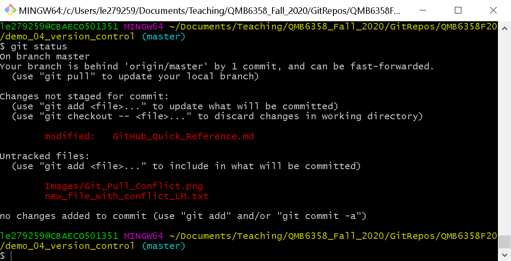

To move *all* of these files to the next stage, enter ```git add .``` (including the dot). 
You can also ```add``` one file at a time by typing, for example, ```git add my_new_file.txt```.


### When this works

After this, the staged files should now be shown in green.

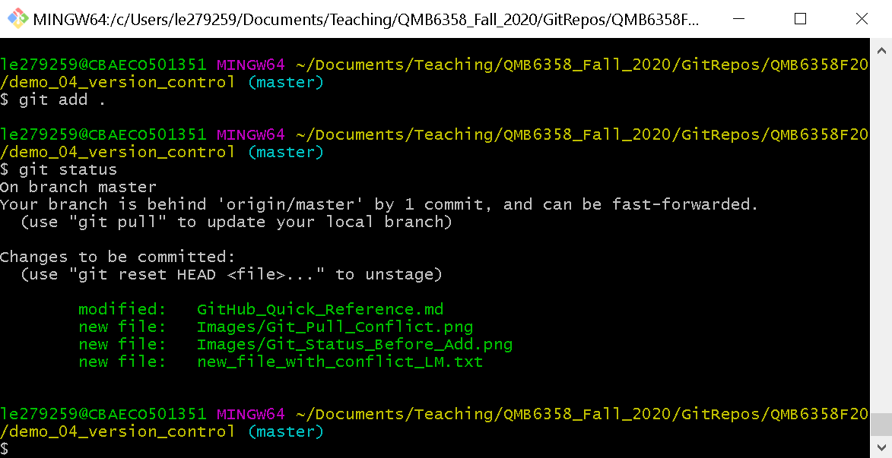


### When this fails

It may not work as expected when you enter this command from another location in your repo--and especially not when outside your repo. 

### How to fix it

Use the ```cd``` command to navigate to the first directory of your repo. 
While you are learning, you can browse to the file on your system in Explorer, right click and select "Git Bash Here" to open a terminal window at the correct location. 


## Guide to ```git``` command ```commit```: to collect your changes into one unit

Typically, you collect your changes into one identifiable unit, such as a new feature or a fix of a bug. 
If you later find you have made a mistake, this is the minimal unit that can be ```revert```ed. 
You usually plan that this does not happen but it is a feature of version control sofware that you can choose the checkpoints at which you can take a snapshot and preserve as a minimal unit to "undo". 

Entering 

```git commit -m "Updated GitHub quick reference"```

uses the ```-m``` option to include a ```m```essage describing the changes. 
The message also communicates to other contributors (including "future you") the purpose of the changes, i.e. what problem it solved. 
You will see the message displayed on the online repo after it is pushed.
A user can click on that message to see the changes you made to the files.
To get your changes out in the open you have to ```push``` them. 


### When this works

You should see a description like this: 

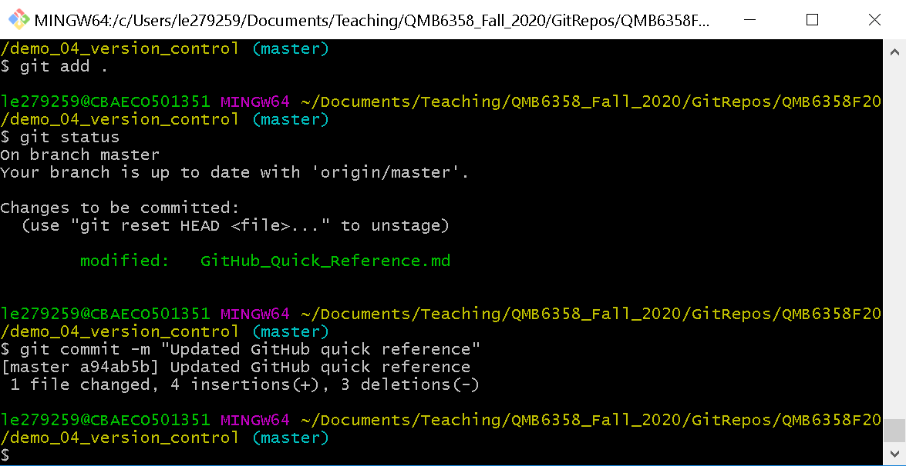

It itemizes the changes made, including counts of the number of files changed. 


### When this fails

This part is fairly foolproof (I think--famous last words). 
If you find an error at this stage let me know and I will add some tips to the manual. 

Not so fast! If you forget to add the option ```-m``` to your ```commit``` command, ```git``` wil *insist* that you leave a message. 
All changes must be documented, even if only with a few words. 
You now have to endure the torture of interacting with the text editor called ```vim``` to enter this message, kicking and screaming, if necessary. 


### How to fix it

Follow the steps outlined after a similar outcome in the help for ```git push``` below. 
I add a message to the top row, including an admission that I forgot to add the message. 

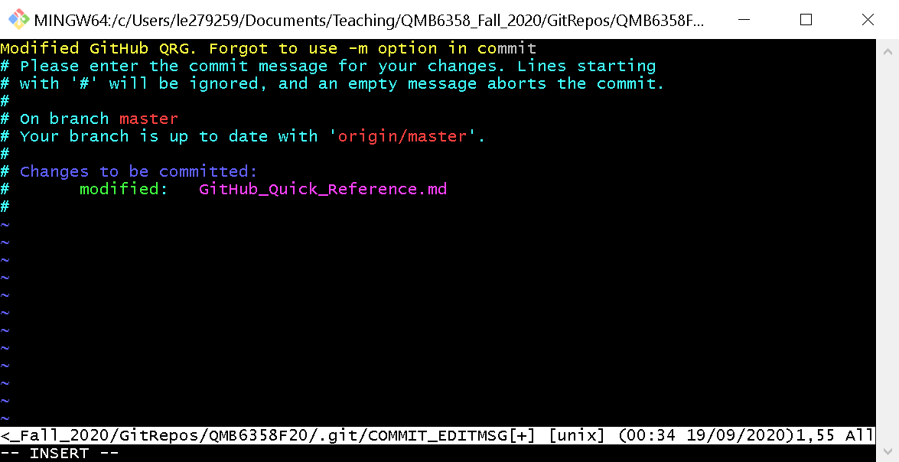

You won't make that mistake again. 
*Now* you are ready to ```push``` your changes.

## Guide to ```git``` command ```push```: to update the repo with your changes

To update the remote repository, and share your changes with others, use the ```push``` command:

```
git push origin master
```

### When this works

When this command is successful, you should see. 

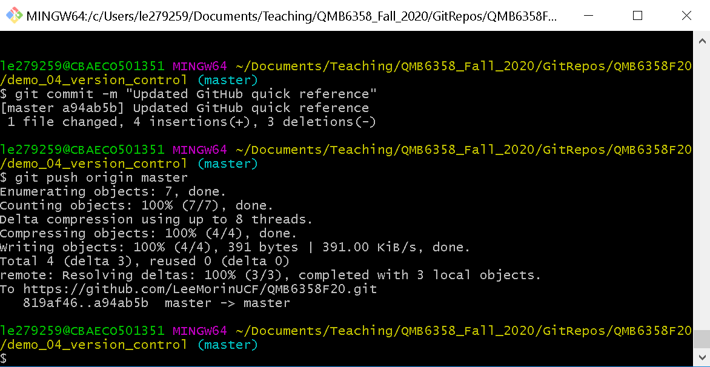

Uneventful is good here. 
No nasty colored error messages, just plain vanilla business as usual: 
an uninteresting list of the reading, counting, compressing, transferring and writing of the files containing the work you just did. 


You should see your latest work in the online repository through your browser. 
Click the refresh button to display the latest content. 
If you check the files you just changed, you should see that your latest changes are online. 
If it is late Wednesday night, you can finally get some sleep. 
You've earned it! 

In any other case...

### When this fails

It might be that other changes were made to the online repository since you last ```clone```d or ```pull```ed your current workspace. 
You can only ```push``` changes if you are working with a current copy. 
If this happens, you will see a message like this: 

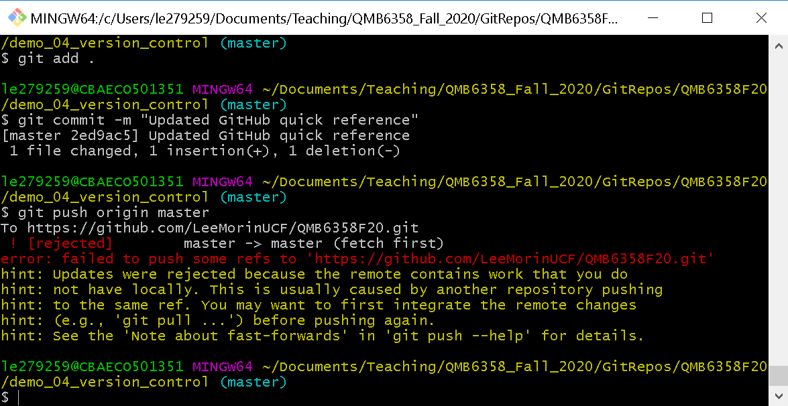


### How to fix it

You have to update your repository by ```pull```ing those changes. 
Go back to ```pull``` those changes and now there are new changes to your local machine.
These changes have to ```add```ed and ```commit```ted, just as if you made those changes yourself. 

Your attempt to ```pull``` might introduce a conflict if new changes were made to the same files in both repositories. 
Follow the troubleshooting tips under the section about ```pull```ing. 


### When *this* fails

If you have not yet ```add```ed and ```commit```ed those changes, you will see a message like this: 

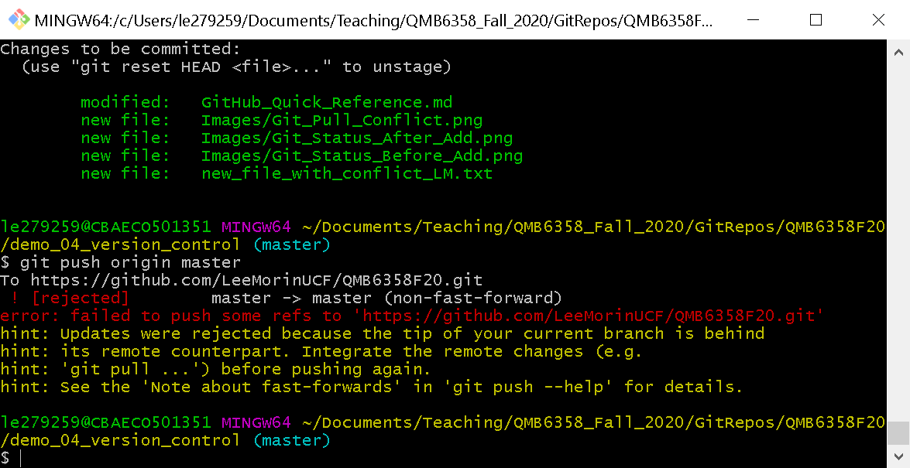


### How to fix *this*

After you pull those changes, you have to ```add``` and ```commit``` them just like any other changes. 
The difference is that this time you do not have a choice on whether to exclude these files: 
they were already "approved" by someone when they ```push```ed them. 
Your copy of the repo is behind theirs and must be made current to include the latest updates before updating with your changes. 
Put another way, you cannot ```push``` changes from a stale copy of the repo.

Now you once again get pushed into the circle of hell that is called ```vim```. 

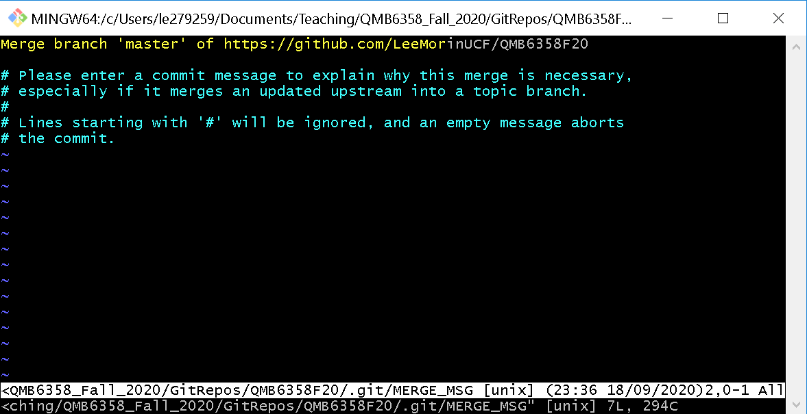

You have committed changes out of order, so you have to explain yourself. 
After pressing ```i``` to ```INSERT```, 
I included this message on the second line of this document:


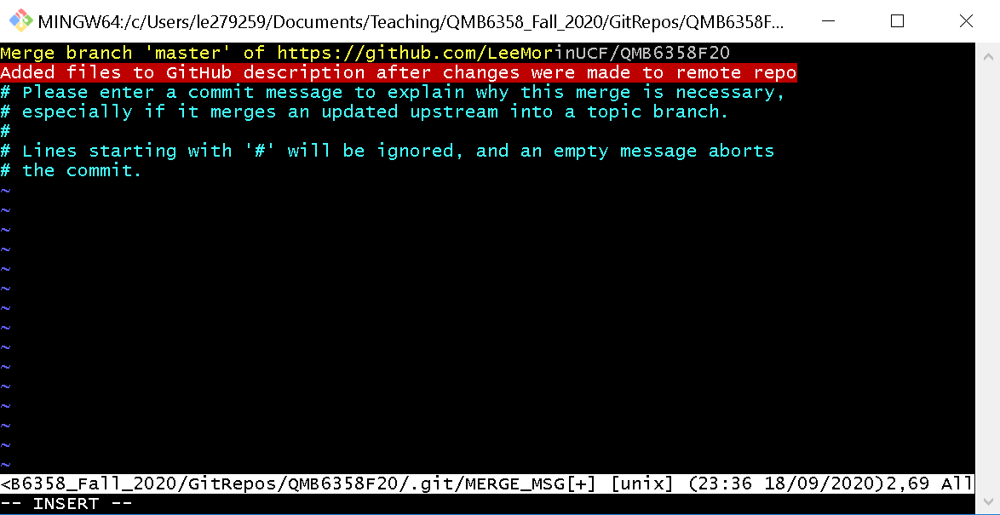

You can see my message highlighted in red. 

To get out of there, I press the arcane sequence of keystrokes ```<Esc>```, ```:```, ```w``` and ```q``` and the screen looks as follows. 

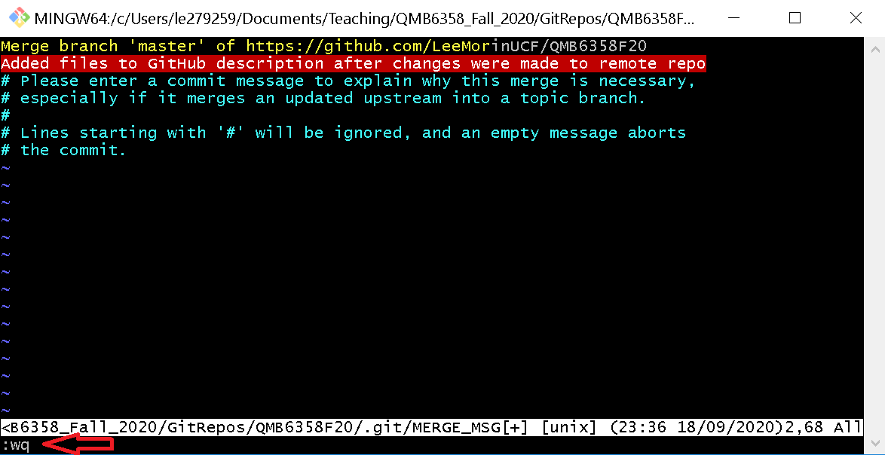

Note the keystrokes I pressed are appearing in the bottom left corner.
After pressing ```<Enter>``` I get back to my terminal window with my ```pull``` completed as if nothing unusual happened. 

Now it is as if you made those changes yourself. 
Checked the ```status``` to see the changes in red, then ```add``` and ```commit``` them and now ```push``` with 
```
git push origin master
```
With much relief you will see the usual result after the ```push``` command, as if nothing unusual happened:

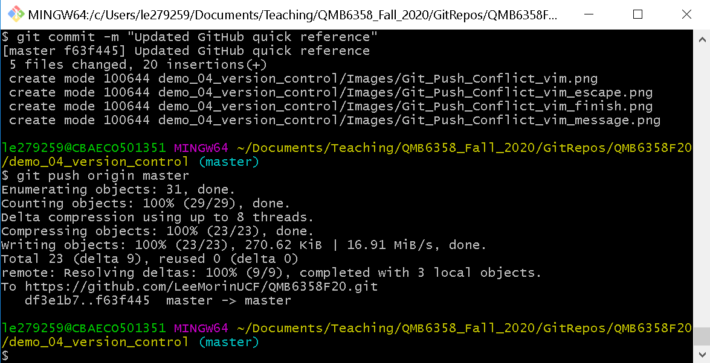


If you see this, congratulations, you survived. 
Next time it will be easier.

If you somehow fall short and are in a bind, you can always...


## ```clone```: If all else fails

If, for some reason, you cannot get your material to commit, you can always start over. 

1. Browse to a new folder that is NOT inside another repo. 
1. Clone the repo with ```git clone <url to your repo>```. 
1. Copy the changes to the files, from the earlier copy where you did the work you want to commit, to the new clone . 
1. Follow the steps ```git add```, ```git commit``` and ```git push```, as outlined in the section on committing new changes. 
1. After ```push```ing the changes, you should see your latest work in the online repository through your browser. 
Click the refresh button to display the latest content. 

The best part about GitHub is that it allows you to make mistakes and start over. 
GitHub is version control software that stored a copy online, which will be avaialble no matter what happens to your physical copy on your laptop. 
You can ```clone``` a new copy and start over. 
You might want to delete the previous ```clone```s but first you should ```git status``` in that folder to see whether you have made some changes that you want to copy to the new ```clone```. 
Then follow the procedure above to ```push``` them to the online repository where they are stored securely. 


## If *even this* fails

As a last resort, worst-case scenario, you can resort to uploading you changes to files one-by-one by interacting with the online repo through your browser. 
I know that this is sometimes the culmination of some frustrating attempts at troubleshooting but sometimes it is the only thing you can get to work this late on a Wednesday night. 
Upload your work for the world to see, get credit for your work, and get some sleep so you can figure it out tomorrow. 
