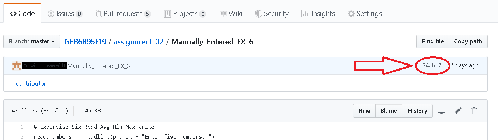

# Version Control

The practice of saving successive versions of computer code is known as version control. 
With this practice, you can securely store past and present versions of your code 
on a remote computer and share it with others.
The version control platform that we will use is called GitHub and the reason for this choice is outlined in Paarsch and Golyaev.


GitHub is an online repository for storing software. 
It is a safe location where you save successive versions of your code
so that past versions of your code can be recovered,
should you need to make corrections or replace your computer.
It is also useful to collaborate on software because multiple
software developers will be able to modify the same online repository.

The code for a particular computing problem will be stored 
in a GitHub *repository*, 
which you can view in a browser.
The repository for a course called "ECP3004S21" is shown here: 


You will find a similar page called "QMB6358F21" for this course. 
In addition, you will create your own repository, 
where you will store your code for the activities in this course. 

There are three methods for accessing GitHub. 
Each has its merits and suitable applications but, as is typical, 
there is a trade-off between simplicity and functionality. 
In particular, the three main approaches are outlined below:
* *Through a Web Browser:* This is a simple method for beginning users, 
  since it uses the point-and-click interface in a browser. 
  The downside is that it is not scalable, 
  in that each file must be uploaded manually, one at a time. 
  This is the method we will use to get familiar with GitHub. 
* *Through a GitHub Desktop:* This is freely-available, user-friendly software that
  allows you to contribute code to a repository after writing software
  on a corresponding folder on your computer. 
  You do your work as you need to and at the end of each coding session, 
  you *commit* and *push* your work by clicking buttons 
  in the GitHub Desktop interface. 
  This carries much of the most common functionality of GitHub with an
  intuitive interface.
  The downside is that it does not support the full array of tools for 
  specialized cases. 
  This is the method that most of you might use throughout the course. 
* *Through a Terminal Window:* A terminal window is the industrial-strength
  interface for all forms of computing applications. 
  It is perhaps the least user-friendly method but it carries with it 
  full functionality to perform any operation in GitHub. 
  This method is one that you should prefer, in order to gain full mastery of the software. 
  Although you might not start with this approach, 
  you may gradually become more comfortable with this method as you gain experience. 


## GitHub Workflow

When you write software on your computer, you can upload it to your repository in
organized pieces. 
First, you stage the changes by *adding* the changes to a batch of changes. 
Next, when a collection of changes has been added, you *commit* the changes, 
which records the set of changes in memory to store the version of your code
at a certain checkpoint. 
The committed files sit on your local machine, such as your laptop, 
waiting to be added to the repository. 
Typically, the new files and the changes to existing files, 
The next step is to *push* your changes to the online repository, 
which makes a permanant 


## Version Control 1: Through a Web Browser

This exercise can be completed on any device that has access to the internet - including your smartphone.

### Open an account

Follow the instructions in [Signing up for a new GitHub account](https://help.github.com/en/articles/signing-up-for-a-new-github-account).

### Start a new coding project

If you want to create a new coding project, you should begin by creating a new repository. 
A repository is a location in your user space that can be used to store your code. 
To initialize a new repository (or repo, for short), follow the instructions in [Create a repo](https://help.github.com/en/articles/create-a-repo).

### Minor edits to an existing project

If you want to make some minor changes to a repo, such as correcting or adding a new file, 
you can [create a new file](https://docs.github.com/en/github/managing-files-in-a-repository/creating-new-files).
If you want to create a new folder at the same time, simply type the new folder name before the new file name, separated by a slash.
For example, to create the new file ```Q1_answer.txt``` in a new folder ```assignment_01```, 
enter ```assignment_01/Q1_answer.txt``` as the new file name. 
You will see the path automatically acept the new folder as you type the slash. 

The above link to [Create a repo](https://help.github.com/en/articles/create-a-repo) 
shows how to modify an existing file (scroll down to see the example).

### Modify an existing project

Several versions of your code can be stored at the same time in units called branches.
The default storage space for a repository is either called the master branch
or the main branch. 
In many cases, you will not want to make edits to the master branch when you are developing new code, so you would [create another branch of the repository](https://help.github.com/en/articles/creating-and-deleting-branches-within-your-repository).
Once you have tested your code, it can be pulled to the master branch by [Creating a pull request](https://help.github.com/en/articles/creating-a-pull-request).
When you are the only contributor, and the code is not running
on a production environment, as for your assignments, 
you might simply push to the main or master branch.


### Forking: Making your own copy of the repo

For extensive edits, or to create a new, separate project built off an existing repository, you may want to [fork an existing repo](https://help.github.com/en/articles/fork-a-repo).
This creates a new copy of the repository that is a separate repository in its own right, 
which traces its origin back to the original repository. 
You wouldn't use this option for a repository that you want to keep confidential, 
since it cannot be kept private, since the creator of the original repository
has access to it, to see how downstream users are using the code. 
As such, you would not use it for your assignments. 

### Synching your fork

If other software engineers have edited the original repository, you will want to update those changes to the version in your repository. This is called synching your fork. Some links to help with this are found in [Syncing a fork](https://help.github.com/en/articles/syncing-a-fork) and a concise version is found [here](https://gist.github.com/CristinaSolana/1885435). Notice, that this advice is stated in terms of the relevant commands through a terminal, instead of a point-and-click interface.
With this approach, GitHub is a much more versatile tool.

## Working in Parallel in Separate Branches

Instead of creating a forked version of another user's repo, 
you can modify another version of the repo within the same repo. 
The separate versions are called *branches*. 
The default branch is called either *master* or *main* but you may choose any name
for the new branch, which could refer to you (the user making the changes)
or to the nature of the modifications to the code in the repo. 
You must be a collaborator of the repo to modify the repo in this way. 
This can be done by clicking the branch button (originally labeled master) 
and typing in the new branch name. 
You will have to toggle the branch button to switch between branches. 
Further instructions are available in this page about [managing branches](https://docs.github.com/en/desktop/contributing-and-collaborating-using-github-desktop/managing-branches).
Now the project can proceed with separate users making parallel changes to 
separate branches. 


With separate users making simultaneous changes, it is best to do your work 
locally and interact with the repo using the terminal window, 
which is a method described below. 
Before then, we will explore the point-and-click interface of GitHub Desktop. 

## Version Control 2: Through GitHub Desktop

This method is more efficient and it separates the act of creating content and uploading it.
You should get in the habit of keeping the online repository up-to-date
every time you create content on your local machine. 
We will use this approach to complete, submit, and test the code in your assignments
throughout the course.

## How to Update your Repo

The main steps are to 
```add```, ```commit``` and ```push``` changes to the repository, 
after making those changes in the corresponding files 
on your local computer.

### Open GitHub Desktop

GitHub Desktop software allows you to manage changes. 
Open this program ...


... and you should see a screen matching the examples below.
You will have to enter your GitHub login credentials
and approve your own access to the site through this particular computer. 


### Cloning a Repository

Once GitHub Desktop is open, the first step is *cloning* your repository. 
This makes a copy of the online repository and places it 
in a folder on your computer. 
Of course, the repository must already exist and you might 
create one through the browser, as described above.
Click on ```File -> Clone repository...```.


Select the repository you wish to clone.


Then press ```Clone```.


Now you should have a local copy of the repository
on the file system on your computer. 
It will be stored in a folder with the same name as the 
repository, e.g. ```ECP3004S21```, in a folder called ```GitHub```.

### Making Changes

Making changes is fairly straightforward. 
You simply create or delete files or make changes to them, 
within the local folder. 
Basically, you do the work you set out to do, 
as if there were no repository. 
That's the beauty of GitHub: you just do your work
and your work gets archived periodically with a few clicks 
of a button. 

In this example, I have added a file. 
As an example, it is an image of the course banner
"Python for Business Analytics".


Following a requirement for Assignment 1, 
I rename it to a specific filename so that it will be displayed 
on the screen in the folder ```assignment_01```. 


You should now see a description of the changes made, 
including an image, in this case. 

### Committing Your Changes

The next step is to ```commit``` your changes. 
This collects any changes that you have made into a 
package of changes. 
Typically, you will collect similar changes in one commit, 
e.g. the solution to Assignment 1, Question 1. 
You type a description of the changes to inform other users, 
which could include *future you*, 
about the nature of the changes and the problem solved. 


After the changes are committed, you can push this bundle of 
changes to your online repository. 


After the changes are pushed, your local repository, 
on your computer, should have the same contents as the remote
repository, the version online. 


### Verifying the Changes

It is often a good idea to verify that the changes have been made
according to your expectations. 
Open your browser to the repository on ```github.com``` 
to see the folder you updated. 


If you are already on that Webpage, you will need to refresh the Webpage. 
You should now see that the change has been made. 
In this case, we have uploaded an image;
in Assignment 1, 
you will upload images of the states of the Rodrego program
to document the operation of the register machine. 


If you notice you have made an error, simply make the change
on your local computer and ```commit``` and ```push``` again. 
Most of the work in computer programming is about
making, detecting, and correcting errors, and GitHub is a useful
tool designed to keep track of all your changes over time. 


### Pulling Changes

Often, there may be changes made to the repo that have not been made
on your local machine. 
This will occur if other programmers are contributing to the repo
or if you made contributions from another computer. 
You can *pull* changes from the remote repository to get your 
local copy up-to-date with the remote repository. 


After pressing the "Pull" button, 
you should see that the updates have been made to your local folder.
You can check for the new files or updated "Last Modified" dates
in an application such as "File Explorer" in Windows. 


## Version Control 3: Through a Terminal Window


To participate in this exercise, you should have installed [Git](https://git-scm.com/) and an associated terminal GitBash.


### Using GitHub for Version Control

If your code is not yet associated with a repository, then your code base is untracked. To track your software, either initialize a new repo or clone an existing repo and add your code to it. We will follow the second approach today, as you will use it to download the code base for the course and modify it as you need. As for initializing your own repo, we will progress to that stage as you begin to work on your own coding projects.

Open a unix terminal and navigate to a directory in which you want to work (```cd path/to/your/preferred/workspace```).

Clone the repo to your workspace:
```
git clone https://github.com/LeeMorinUCF/ECO5445F18
```

To be nice to the repo owner, you should start your own branch of the repo, on which you can make your own changes.
```
git branch your_new_branch_name
```
Then move into that branch:
```
git checkout your_new_branch_name
```

Then make changes to files and add files to your own local copy.

When you want to add changes to the local branch, ```add``` the files:
```
git add .
```

When you want to commit those changes to your local repo, you can enter
```
git commit -m 'Description of the changes you made goes here'
```

Finally, if you have the permissions to do so, you can push your changes to the remote repository:
```
git push origin your_new_branch_name
```
You may be asked for login credentials, which will be the credentials for your GitHub profile.

If all goes well, you can refresh the repo in the browser, change the branch tab to ```your_new_branch_name``` and you should see your changes to the repo. These modifications are now part of the remote repository and are safely stored regardless of what happens to your local computer. Moreover, your teammates on a coding project can view your changes and work them into a larger coding project.

A helpful tip is to get accustomed to using the ```git status``` command. This will tell you the current status of the changes that you have made. You can use it between the ```git add```, ```git commit``` and ```git push``` commands above to see how the changes progress.


## Privacy Settings

### Making a Repo Private

In a business setting, there may be sensitive information for which a select group has access.
A repo and all of its forks can be made private, so that only the collaborators can gain access.
However, the privacy setting places the same restriction for all collaborators and all forks, meaning that any collaborator can see the contributions made in every fork, and all forks must have the same privacy setting as the upstream repo.
Often this setting is sufficient and the procedure for enacting this setting is as follows.

1. In a browser, browse to your git user page, sign in and click the 'Settings' tab.

2. Highlight 'Options' and scroll all the way to the bottom (yes, all the way into the 'Danger Zone') and click the button 'Make Private' in the section 'Make this repository private'.

3. Enter the repo name to make it official.
This is in the 'Danger Zone' because this could block access to someone who depends on this information, interrupting their workflow. In our case, it allows you to keep your work private.

4. After this change, other collaborators cannot see your work, so you will have to invite them as collaborators. Scroll to the bottom, enter their username, such as LeeMorinUCF, and click 'Add collaborator'. The collaborator will be notified and will be sent a link to activate their status.

### Making a Private Mirror of a Public Repo

In order to have separate access restrictions to a copy of the repo, a simple solution is to create a new repository that mirrors the content of the original. 
You might use this mirror the same way you would use a fork, except that it is no different than any other repository. 

A command line version of this procedure is available here: [GitHub: How to make a fork of a public repository private?](https://medium.com/@bilalbayasut/github-how-to-make-a-fork-of-public-repository-private-6ee8cacaf9d3)

In essence, this amounts to creating a separate repository that happens to contain the same information as the original. 

Since this is a one-time occurrence, this can be done in your web browser from your GitHub user page. 

1. Under the Repositories tab, click the green New button. 
2. In the next screen, choose a name for your new repo. 
3. Before clicking the green Create Repository button, set this new repo to Private. 
4. After clicking the Create Repository button, you will move to a screen to add content to the new repo. 
5. Since you are creating a mirror, scroll to the bottom and choose the Import Code button and enter the url for the original repo that you want to clone. 
6. If you have access to this repo, it will initialize the content to your new repo. 
7. This repo is ready to be cloned to your local machine. Use the ```git clone``` command as usual.
8. In order to pull any new content to the original repo, this original repo will have to be set as the upstream repo. 
After cloning the new repo to your local machine, enter a command like the following

```
git remote add upstream https://github.com/UpstreamGitUserName/UpstreamRepoName.git
```
where you would get the url in the same way you would to clone the original upstream repo. 

9. Now you can pull new content from the upstream to your local machine. 

```
git pull upstream master
```
where the pull is from the master branch of the upstream repo and not the orign. 

10. Now these updates are on your local machine but have not been pushed to your mirror of the repo. 

```
git push origin master
```
will work the same as for any other content you add, except these are already added and committed to the upstream repo. 


## Getting Your Bearings

With all of the repositories, branches, forks and mirrors, it is easy to get lost. When working in a repo, one can find the url for the origin of your clone by entering the following.

```
git remote get-url origin
```

While this command does not work on all platforms, the following provides more verbose output.

```
git remote show origin
```

Notice that the output will show the url of the repo from which new content is fetched, the url to which your updates are pushed, along with a lising of the branches of the repo.

For forked repos, the above commands can be modified with ```origin``` swapped for ```upstream``` to show the references for the upstream repo from which this repo was forked.


## Summary: The Commands Used Most Often

### Updates to the Upstream Repo 

For example, when your instructor adds new content, pull those changes to your local machine and push them to your mirror of the repo:

```
git pull upstream master
git push origin master
```

### Updates to Your Local Copy

When you are working on your own coding project, add commit and push those changes to your repo:

```
git add .
git commit -m 'Describe changes here'
git push origin master
```

This command will not work if your local copy is not up to date. 

### Updates from Another Clone of Your Repo

This command is used when you want to pull any changes from other contributors (such as group members on a team project) or when you change devices. In both of these cases, your current device will not have the most recent copy. 

```
git pull origin master
```

As mentioned above, if you want to push updates and your version is not current, you will have to pull the recent changes before you can push your updates to the repo. 


## Appendix: The Command You Hope to Rarely Use

Sometimes you might commit a change that you will later want to remove. 
Even if a commit is already pushed, it is possible to reverse that commit, 
using the command ```git revert <commit hash>```, 
where the ```<commit hash>``` is an alphanumeric code that uniquely identifies the commit. 
Browse to any file in the commit and click on the link or message referring to the commit and obtain the commit hash. 




Then enter this into your terminal

```
git revert 74abb7e
```

Then there is an additional step. 
Since reverting a commit is an unusual step, the default action after this command is to add a message to the (inverse) commit. 


This screen is a classic text editor called ```vim```. 
If you are happy with the comments as is, exit ```vim``` by pressing ```:``` then ```q``` to quit. 
If you do want to add a comment, press ```i``` to enter ```INSERT``` mode, 
then navigate with the arrow keys and type in a coment. 
Next press the ```Esc``` key to exit ```INSERT``` mode, 
followed by ```:``` then ```wq``` to write the changes and quit.  
You should now get back to your terminal prompt. 

The next step is to push these changes to your repo. 
The reverted content is the inverse of the very same content that was added to the original commit. 
Each line and each file that was added was then deleted in the revert and vice versa for lines and files deleted in the original commit. 
It is as if you reversed those changes manually and then added and committed the changes. 


P.S. This example was not the student's fault in any way. 
I aciddentally pushed his content to the upstream instead of the origin of his mirror. 
It happens to everyone...eventually. 
Now we know how to fix it. 


